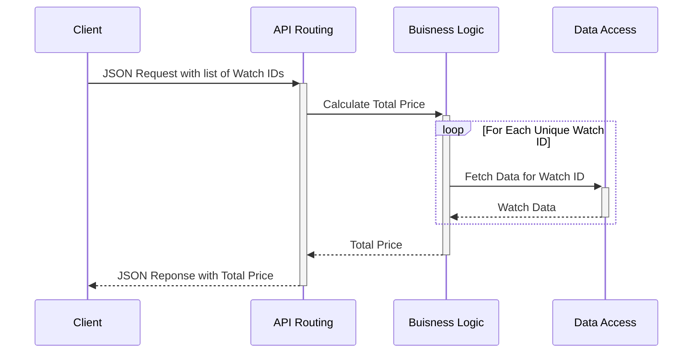

# watch-shop
Quick Flask API Demo implementing a checkout endpoint. See `tests/api_test.sh` for example usage.

## Running the Application
Install Python 3.7 or newer from https://www.python.org/downloads/

Install Flask as described at https://flask.palletsprojects.com/en/2.2.x/installation/

The application can be run locally under the Flask development server by 
running `python -m flask run` when in the watch-shop directory

## Running Tests
Most tests are implemented in Python's UnitTest framework and are in ``test_<module-name>.py`` files within the same directory 
as the modules they test. Run these from the top level directory with `python -m unittest discover -v`

The API proper can be exercised by starting the application and then running `tests/api_test.sh`

## Design Notes
The application is structured into main 3 units, forming a dependency stack.

| Design Unit    | Implementation Location | Description                                                                                                                             |
|----------------|-------------------------|-----------------------------------------------------------------------------------------------------------------------------------------|
| API Routing    | ``./app.py``            | Only module that interacts with the Flask Framework, provides marshalling of Request and Response data for the rest of the application. |
| Business Logic | ``./business_logic/``   | Logic for calculating the checkout result. Only module that understands how to interpret watch data.                                    |
| Data Layer     | ``./data_layer/``         | Abstraction of the data store used to provide watch data. In this implementation the data store is a CSV file                           |

Each unit provides an interface to the one above implemented using built in
datatypes. Each module can only communicate with the layer above or below it in, 
simplifying dependencies. Modules should not make any assumptions about the
implementations of others.

The call flow through the modules for a checkout request is as follows.

